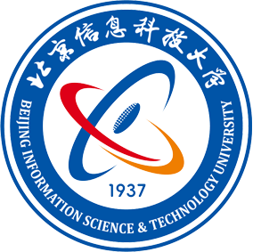

# Personal Resume

## A brief chronological history in academia and industry.

| Period            | Logo                                      | Affiliation                              | Position                     | Location       |
|-------------------|-------------------------------------------|------------------------------------------|------------------------------|----------------|
| 2001.09 - 2005.07 |       | Beijing Information Technology Institute | Bachelor student             | China, Beijing |
| 2006.08 - 2009.07 |        | Peking University                        | Master student               | China, Beijing |
| 2009.07 - 2009.12 |        | Xinhua News Agency                       | Software Engineer            | China, Beijing |
| 2010.01 - 2011.08 |   | Teradata (Beijing)                       | Testing Developer            | China, Beijing |
| 2011.08 - 2014.07 |         | Microsoft (Beijing)                      | Software Develop Engineer II | China, Beijing |
| 2014.09 - 2020.01 |        | IBM (Singapore)                          | Team Lead                    | Singapore      |
| 2020.06 - 2021.08 |   | AscentisCRM Private Limited              | AVP                          | Singapore      |
| 2021.08 - 2025.08 |        | Nanyang Technological University         | Full-time PhD student        | Singapore      |
